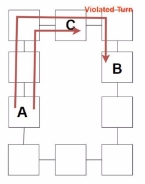
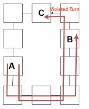

Fault Tolerant Routing algorithm of Network on Chip.

Haoyu Fu

1  **Introduction**

**Motivation of Irregular Topology**

Network on chip (NoC) is a new technology that is replacing traditional non-scalable bus-based systems. NoC is a plat- form that is built around a dedicated network. Its primary responsibility is to build a suitable multi-core system capable of providing low-latency communications services and a high-performance communication network. The selection of topo- logical structure is critical to an NoC design because it is one of the main technologies of NoCs. The 2D mesh topology is typically recommended for chips with a large number of cores. However, there are a variety of communication reliability concerns, heterogeneous blocks, or other fabrication flaws, and normal topology are ineffective in this case [\[6\].](#_page11_x56.69_y314.25) For exam- ple, SRAM, CPU, and other components with differentsizes are connected on the same chip in differentcoordinates, and theymayhaveonly1communicationinterfaceontheirbody. Asaresult,simpleroutingapproachessuchastheXYrouting algorithm cannot be used in irregular topology.

Aside from regular topology, a regular mesh network’s traditional routing algorithm is incompatible with an irregular mesh network. To keep the communication still working in irregular topology, efficient routing techniques are needed. The research’s main goal is to create a 16x16 irregular topology by customizing the routing algorithm.

Irregular topology is also motivated by fault tolerance, which is crucial for Network-on-Chip research. A fault in an NoC can result in communication issues, data loss, and system failures, all of which can have major ramificationsfor the system’s performance, dependability, and av[ailability\[5\].](#_page11_x56.69_y274.40) As a result, fault tolerance strategies are required to ensure that an NoC-based system operates properly even in the presence of problems. In our simulation, the fault is modeled as a broken path between each router node, and this would also cause irregular topology.

In addition, it is crucial to ensure that the proposed routing algorithm is designed to be deadlock-free. A deadlock is a condition that can arise in a computer network in which a group of processes gets stuck because each is waiting for another process to relinquish a resource. A deadlock can arise in the context of a Network-on-Chip (NoC) when there is a cycle of dependencies among the packets being transmitted, such that each packet is waiting for a resource held by another packet in the cycle. When there is a deadlock, the NoC can become unresponsive and fail to send packets, resulting in system crashes and data loss.

**up-down Routing**

The up\*/down\* routing algor[ithm\[1\]](#_page11_x56.69_y76.97) is a popular routing scheme used in commercial networks with regular or irregular typologies. It avoids deadlocks and enables the utilization of all links. The algorithm computes routing tables based on the assignment of directions ("up" or "down") to operational links in the network by building a spanning tree. Two methodologies for building spanning trees are the BFS (Breadth-First Search) spanning tree and the DFS (Depth-First Search) spanning tree.

To implement Up\*/Down\* routing, the algorithm follows a rule: a legal route must have zero or more "up" direction links followedbyzeroormore"down"directionlinks. Thisway, cyclicchanneldependenciesareav[oided\[1\].](#_page11_x56.69_y76.97) ForBFSspanning tree:

1. Choose a switch as the root.
1. Arrange the rest of the switches in a single spanning tree.
1. Assign "up" or "down" directions to the links based on their position relative to the root switch and their identifiers.

For DFS spanning tree:

1. Choose a switch as the root using heuristic rules.
1. Build the tree using a recursive procedure and heuristic rules for adding switches.
1. Assign direction to links based on positive integer labels assigned to each switch.

In our experiment part, we implement up\*/down\* routing algorithm by DFS spanning tree. We use it as our baseline algorithm and compare its performance with that of our State Machine Routing in our simulation section.

**No Middle/Edge Topology**

Irregular mesh topology has the same description as full mesh topology, including module addresses, with the exception that some routers and links are absent, as shown in Figure[ 1c.](#_page2_x56.69_y47.73) The router nodes in the network such as nodes a5 a6 etc can adopt the XY routing algorithm because such nodes are part of a regular structure and the XY scheme is very easy. But the router nodes such as a1 b2 etc must be adopted a special routing algorithm to keep the network connected. The example of no edge topology and no middle topology is shown in Figure[ 1a ](#_page2_x56.69_y47.73)and Figure[ 1b ](#_page2_x56.69_y47.73)The condition of each path of one router could be represented by 1(There is a path) and 0(broken path) in code.

**Our Goals**

We first create a no middle/edge irregular topology that could run a fault-tolerance model. Then, implement the existing up/down routing algorithm as the baseline, and create your own efficient routing algorithm for irregular topology with

  

(a) No Middle Ex[ample\[6\]](#_page11_x56.69_y314.25) (b) No Edge Example [\[6\]](#_page11_x56.69_y314.25) (c) Proposed Topology Figure 1: Irregular Topology

deadlock-free guaranteed. Finally, we simulate the routing algorithms in the Noxim simulator.

The rest of this report is organized as follows: Section 2 explains our efficient routing algorithm - State Machine Routing Algorithm. Section 3 displays our simulation platform and configuration, and Section 4 presents the simulation result and discussion. The paper is concluded with Section 4.

2  **State Machine Routing Algorithm**

In this section, we will introduce our state machine routing algorithm. In section 2.1, we will introduce the basic idea of our algorithm. In section 2.2, we will describe the states of our algorithm and their transitions. In section 2.3, we would clarify that our algorithm is not deadlock-free and prove that any routing algorithm without node tables or similar methods which could obtain a global view of the irregular topology can’t be deadlock-free.

1. **Basic idea**

Our proposed state machine routing algorithm selects the moving direction of each flitbased on the state of each flit. The transitions of states, which would be discussed in detail in section 2.2, depend on the coordinates of the current router and thedestinationrouter, andtheirregularattributesofthecurrentrouter. Theroutingpathmustbeselectedwithregardtothe irregular attributes of the current router is the most significant discrepancy between the routing algorithm for the regular 2D mesh and irregular 2-D mesh. In our state machine algorithm, we define the irregular attributes by adding a broken flagto each output direction. If the broken flagfor one output direction is one, there is no neighbor router in that direction.

According to our assumptions, a flit would change its state in order to detour it when it encounters an irregular topology, such as a no-middle or no-edge topology, which would be indicated by the broken flags of its current router. There are two ways, clockwise and counter-clockwise, to detour a no-middle topology and only one way, either clockwise to counter-clockwise, to detour a no-edge topology. However, only one way to detour a no-middle topology would not violate the negative-first routing algorithm. The reason would be shown in section 2.3. While in a regular 2D mesh, there are four directions, eight 90-degree turns, and two abstract cycles of four turns. We add two turnarounds from north to

south and from east to west for the irregular 2D mesh. The reason would be discussed in section 2.2.

2. **state transition**

Our state machine algorithm has 8 states: GoX, GoY, DetourX, DetourY, UturnWE, UturnSN, VibrationNW, and Vibra- tionES. The transition of each state is described as follows.

1. GoX : Gox is the initial state of each flit. When the flit is in the GoX state, it will travel along the X dimension until the ordinate matches its destination or its traveling direction is broken. If the current router’s x-coordinate is smaller than the target point’s x-coordinate, the flit will go east. If the current router’s x-coordinate is larger than the target point’s x-coordinate, the flitwill go west. If the current router’s x-coordinate is equal to the target point’s x-coordinate, the flit would undergo a transition to the GoY state. If the traveling direction is broken, it would transition to the DetourX state or the DetourY state.
1. When the flitis in the GoY state, it will travel along the Y dimension if the corresponding direction is not broken. If the current router’s y-coordinate is smaller than the target point’s y-coordinate, the flit will go north. If the current router’s y-coordinate is larger than the target point’s y-coordinate, the flit will go south. If the current router’s y- coordinate is equal to the target point’s y-coordinate, the flit would transition to the GoX state. If the traveling direction is broken, it would transition to the DetourX state or the DetourY state.
1. When the flitis in the DetourX state, it will travel along the X dimension until it findsan available path along the Y dimension. If it findsan available Y path, it would transition to the DetourY state. Otherwise, it would turn around and go along the inverse direction.
1. When the flitis in the DetourY state, it will travel along the Y dimension until it findsan available path along the X dimension. If it findsan available X path, it would transition to the GoX state. Otherwise, it would turn around and go along the inverse direction.
1. The flitwould undergo a transition from any state to the VibrationNW state whenever it went from the south router and wants to go west. Since this turn is prohibited by the Negative-first algorithm, the flitwould turn around instead. TwoallowedwaystoturnaroundattheVibrationNWstateareshowninFigure[2.](#_page3_x56.69_y579.11) Theflitwouldundergoatransition from the VibrationNW state to the GoY state once it could.

 

(a) (b)

Figure 2: two ways to prevent going west after going north in the vibrationNW state

6. The flitwould undergoa transition from anystatetotheVibrationESstatewheneveritwentfromthewestrouter and wants to go south. Since this turn is prohibited by the Negative-first algorithm, the flit would turn around instead. Two allowed ways to turn around at the VibrationES state are shown in Figure[ 3.](#_page4_x56.69_y86.29) The flitwould transition from the VibrationES state to the GoX state once it could.

 

(a) (b)

Figure 3: two ways to prevent going south after going east in the VibrationES state

7. The flit would transition from any state to the UturnWE state whenever it wants to go east after going west. Since this turnaround direction is prohibited by our algorithm, we would use several legal steps instead to achieve the turnaround from west to east. Two ways to achieve it are shown in figure[4.](#_page4_x56.69_y280.81)

 

(a) (b)

Figure 4: Two ways to achieve Uturn from west to east. The flitin the current router, which went from router C, can’t go back to router C directly.

8. The flitwould transition from any state to the UturnSN state whenever it wants to go north after going south. Since this turnaround direction is prohibited by our algorithm, we would use several legal steps instead to achieve the turnaround from South to north. Two ways to achieve it are shown in figure[5.](#_page4_x56.69_y516.24)

 

(a) (b)

Figure 5: Two ways to achieve Uturn from south to north.The flitin the current router which went from router A can’t go back to router A directly.

3. **deadlock proving**

In this section, we would first prove that any routing algorithm without node tables or similar methods which could obtain a global view of the topology can’t be deadlock-free and then describes when would our algorithm generates deadlock. In a regular 2D mesh, there are four directions, eight 90-degree turns, and two abstract cycles of four turns. One turn from each cycle must be prohibited to prevent deadlock. Of the 16 different ways to prohibit these two turns, 12 prevent deadlock and three are unique if symmetry is taken into account [\[4\].](#_page11_x56.69_y234.55) The three deadlock-free ways for the regular 2D mesh are the west-fist algorithm, the North-last algorithm, and the Negative-fist algorithm. However, in the irregular 2D mesh which only consists of the no-middle topology, the Negative-first is the only way to prevent deadlock if there is a node table or similar method which could know the global topology. And none of these algorithms is dead-lock free for irregular topology which contains both the no-middle and no-edge topology.

**Theorem 1** *Negative-first algorithm is the only deadlock-free algorithm only for the irregular 2D mesh without no-edge topology.*

**Proof** *Since some parts of the irregular 2D mesh are regular 2D mesh, algorithms other than the west-fist algorithm, the North-last algorithm, and the Negative-fist algorithm can’t be deadlock-free. As shown in figure[ 6,](#_page5_x56.69_y286.89) both the west-first and the North-last algorithms would occur deadlock in some cases.*

 

(a) North-last (b) West-first Figure 6: Deadlock for the North-last and West-first algorithm

*As shown in the figure[ 7,](#_page6_x56.69_y47.73) the negative-first algorithm is deadlock-free in the no-middle 2D mesh but would occur deadlock in the no-edge 2D mesh in some cases.*

**Theorem 2** *Without the node table or similar methods which could know the global view of the irregular topology, the Negative-first algorithm can’t be deadlock-free for no-middle 2D mesh.*

**Proof** *As shown in the figure[ 8.](#_page6_x56.69_y314.22) The flitcan’t distinguish the destination point B and point C since both the ordinate and horizontal ordinate of both B and C is larger than the ordinate of the current router A. Thus it can’t change the routing direction depending on the specificposition of the destination, which results in deadlock for each direction.*

Although our algorithm does not violate the turn model of the Negative-first algorithm without the node table, the extra turnaround would cause deadlock in some cases. Since turnaround is inevitable in the irregular 2D mesh, we choose to use turnaround other than violating the Negative-first algorithm to trade-off between the deadlock rate and the traffic latency.

  

(a)deadlock-freeintheno-middletopology (b)deadlock-freeintheno-middletopology (c)deadlock-freeintheno-middletopology

 

(d) deadlock-free in the no-middle topology (e) deadlock in the no-edge topology Figure 7: The deadlock analysis of the Negative-first algorithm

 

(a) deadlock using clockwise routing (b) deadlock using counterclockwise routing

Figure 8: Deadlock for Negative-first algorithm in no-middle topology without node table or similar methods which could know the global view of the irregular topology

3  **Simulation Setup**
1. **Noxim Simulator**

Noxim[simulator\[3\]](#_page11_x56.69_y176.76)[\[2\]](#_page11_x56.69_y136.92)isaSystemCcycle-accuratesimulatorforNetwork-on-Chip,developedattheUniversityofCatania (Italy). We chose Noxim as our simulator because the code of Noxim is still under maintenance and the code follows Software Engineering specifications, which makes it easier to read and understand the code. The Advantages of Noxim include fast simulation, easy running configuration,simple results format et al.

 

(a) Noxim Functionalities (b) Noxim Flits Transmission Communication

2. **Running Setup**

|Environment|
| - |
|OS|Compiler|-std|CPU|Simulator Ver- sion|Memory|
|Ubuntu 22.04|g++-11.3.0|c11|Intel i9-9900K|Release 2022|16GB|

Here are some simulation parameters: Package Size: 8 Flits; Buffer Depth: 16 Flits; Number of Virtual Channel: 1; Se- lection Strategy: Random; Simulation Cycle: 20000 cycles; Package Injection Cycle: 3000 cycles; Cycle Time: 1 ns; Flow Control: Wormhole algorithm; OfferedLoad: Our control variable. Controlled by Packages per 100 cycle(Injected speed) and maximally injected Package Number(Stop condition); Routing Algorithm: UP\*/DOWN\* and State Machine algorithm; Traffic: Random, modifiedbit-reversal, Permutation Traffic.

3. **Evaluating Metrics**

We use latency vs. offeredload, accepted package in fixtime vs. offeredload and network throughput vs. offeredload as our evaluating metrics. The bit-reversal algorithm is modifiedto fitthe irregular topology. We ran 6 experiments with the same parameter settings to get both the performance of UP\*/DOWN\* algorithm and the State Machine algorithm under three differenttrafficpatterns. The next section shows our results and discusses the results.

4  **Result and Discussion**

Figure[ 10a ](#_page8_x56.69_y161.48)demonstrates that the latency continuously increases until the injected package ratio reaches around 0.1 in all 3 typesoftrafficinUP\*/Down\*. Then, thelatencyofbit-reversalandpermutationtrafficslightlydecreasestoapproximately 7000 cycles at injected rate is 0.1. The latency of random trafficcontinuously increases and finally reaches 10000 cycles. Overall, the average latency is proportional to the network package injected ratio for random traffic, and this obeys the characteristics of random trafficas the source and destination are randomly chosen. The decrease in the other two types of trafficcould be network congestion at higher injected package ratios, as the remaining packages cannot be received (low received ratio). Thus, the recorded average latency may only consider the early stage package received latency before mass congestion.

The Figure[ 10b ](#_page8_x56.69_y161.48)shows the latency of our STA in these 3 kinds of trafficpatterns. It is obvious that the latency of random trafficis bouncing between 0 and 9000 cycles. The latency of bit-reversal and permutation trafficlooks similar, which is below 1000 cycles in all injected ratios. Besides, both these types of traffichave a significantly low latency before injected ratio reaches 0.35, and they perform a steady increase to 900 cycles at 0.1 injected ratio. The differencebetween random trafficand the other two trafficpatterns could be explained by the other 2 trafficpatterns are more regular, which provides more logical package movements and gives more stable latency.

Overall, the speed of our proposed STA outperforms that of the UP\*/Down\* routing algorithm, as the average latency cycles of our STA is approximately ten times less than that of the UP\*/Down\* routing algorithm.

 

(a) UP\*/DOWN\* (b) State Machine Algorithm

Figure 10: Latency vs. Load

The Figure[ 11a,](#_page9_x56.69_y89.75) Figure[ 11b ](#_page9_x56.69_y89.75)shows how the ratio of the number of the received package to the number of sending packages changes with the offeredload. The X-axis represents the injected package per cycle. (e.g. 0.05 means we inject 5 packages per 100 cycles on average.). We only inject packages at the first 3000 cycles and cut offthe simulation when 20000 cycles are reached. There are 17000 cycles in which the network does not generate any new package but only routes the existing package in the network. The y-axis is the received/sent ratio.

As we can see from Figure[ 11a,](#_page9_x56.69_y89.75) the UP\*/DOWN\* routing algorithm behaves quite well when the injected rate is less than 0.01. After the injected rate goes beyond this point, the received ratio will decline sharply at first and will eventually level off. It is also clear that the trafficpattern does not affectthe received ratio significantly. At least, the three trafficpatterns we used in our experiment did not alter the received ratio. Figure[ 11b ](#_page9_x56.69_y89.75)shows the result of our State Machine algorithm. In general, our algorithm can do better in the received ratio compared to the UP\*/DOWN\* algorithm. The problem with our algorithm is that the performance is not stable. We can see from the figurethat the received ratio of our algorithm does not decline steadily and sometimes goes up as the injected rate increases. The trafficpatterns also affectthe performance of our algorithm dramatically. In particular, in the random traffic,the received ratio drops only after the injected rate exceeds 0.025, which is much better compared to all other ex- periments under the same parameter settings. However, the received ratio plunges right after that and then goes up. We don’t know what happened exactly, but one possible explanation is that, in that experiment, the randomly generated traffic makes some nodes being accessed more frequently than others, and the uneven trafficleads to the congestion of some parts of the network which our routing algorithm favor. We can also see the received ratios tend to converge to a value for all three traffic when we keep increasing the injected ratio. Compared with UP\*/DOWN\* algorithm, this converged value is lower. In conclusion, our algorithm can do better than UP\*/DOWN\* algorithm in the received ratio when the package injection rate is not intensive. The weakness of our algorithm is its instability and lower bound performance compared to UP\*/DOWN\* algorithm.

 

(a) UP\*/DOWN\* (b) State Machine Algorithm

Figure 11: Accepted Ratio vs. Load

Figure[ 12a ](#_page9_x56.69_y514.18)displays the network throughput of UP\*/Down\* routing algorithm. Generally, there is no big difference be- tween the 3 types of traffic,and the differenceamong them is approximately 9%. The throughput continuously increases until the injected ratio reaches 0.01, and there seems to be a threshold of this routing algorithm. The average Network throughput is around 1.84 flitsper cycle and they are all below 2 flitsper cycle.

Figure[12b](#_page9_x56.69_y514.18)showstheaveragenetworkthroughputofourSTAfor3trafficpatterns. Thereseemsnoregularconclusion forthese3traffic,butthethroughputisrelativelylowcomparedwiththepreviousUP\*/Down\*routingalgorithm. However, asourSTAismuchfasterthanUP\*/Down\*,theonlyreasontoexplainthisisthattheUP\*/Down\*isanon-minimalrouting. This means that the package might move a longer distance in the network, and there might be more package moving at the same time, which cause a larger average network throughput. Although our design is also non-minimal routing, we design our algorithm to guarantee the package move as less distance as possible. Thus, our throughput is less than UP\*/Down\*.

 

(a) UP\*/DOWN\* (b) State Machine Algorithm

Figure 12: Throughput vs. Load

5  **Conclusion**

In our initial proposal, we outlined the rationale behind designing an irregular topology with a suitable routing algorithm. After that, we describe our theory for the state machine algorithm and design the states for its fundamental operation. The UP\*/Down\* routing algorithm is then implemented in Noxim, followed by the simulation of our own state machine algorithm as an improvement for fault tolerance and deadlock-free. The outcome demonstrates that our STA is signifi- cantly quicker than the UP\*/Down\* routing algorithm, has a better-received ratio, and travels less overall distance for each package.

**5.1 Future Work**

We came upwith an idea that can allowour algorithmtobedeadlock-freeatlast. Wecanusetwovirtualchannelsand only allow packages/flitswith specificstates to reside in one of the two virtual channels. For example, we can simply move the flit to virtual channel 2 when it is about to go backward and leave flits with all other states in virtual channel 1. Besides, the node table could be used to solve the deadlock described in the previous section.

**References**

1. José Carlos Sancho, Antonio Robles, and José Duato. “A flexible routing scheme for networks of workstations”. In: *High Performance Computing: Third International Symposium, ISHPC 2000 Tokyo, Japan, October 16–18, 2000 Proceedings 3*. Springer. 2000, pp. 260–267.
1. Vincenzo Catania et al. “Energy efficient transceiver in wireless network on chip architectures”. In: *2016 Design, Automation & Test in Europe Conference & Exhibition (DATE)*. IEEE. 2016, pp. 1321–1326.
1. Vincenzo Catania et al. “Improving the energy efficiencyof wireless Network on Chip architectures through online selective buffers and receivers shutdown”. In: *2016 13th IEEE Annual Consumer Communications & Networking Conference (CCNC)*. IEEE. 2016, pp. 668–673.
1. Christopher J Glass and Lionel M Ni. “The turn model for adaptive routing”. In: *ACM SIGARCH Computer Archi- tecture News* 20.2 (1992), pp. 278–287.
1. Jie Wu. “A fault-tolerant and deadlock-free routing protocol in 2D meshes based on odd-even turn model”. In: *IEEE Transactions on computers* 52.9 (2003), pp. 1154–1169.
1. QingliXiaoetal.“AnefficientroutingschemeforirregularmeshNoCs”.In:*2013IEEE4thInternationalConferenceon Electronics Information and Emergency Communication*. IEEE. 2013, pp. 121–124.
12
